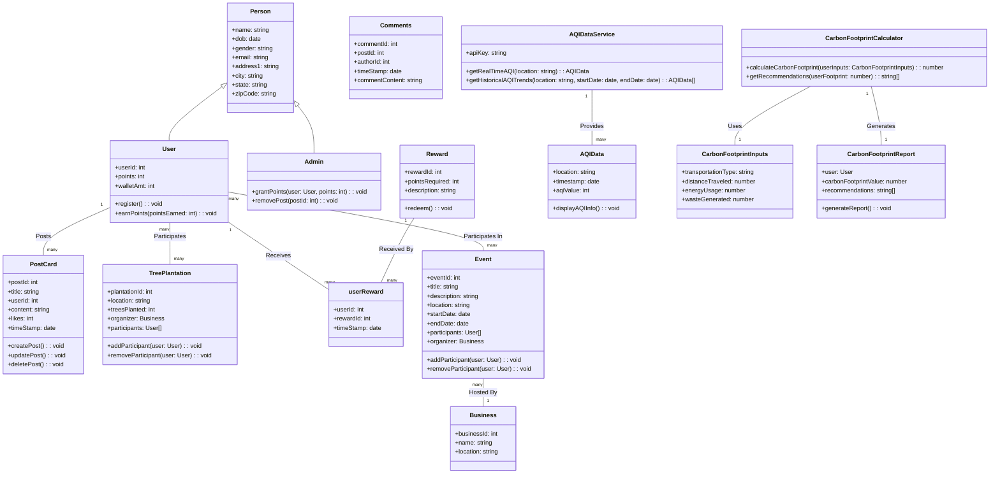

# EcoEngage Portal

Connecting communities for sustainable actions and environmental impact.

## Description

The EcoEngage Portal is an online platform designed to raise awareness and promote action on climate change. It offers a wide range of features and functionalities to engage users in environmental initiatives and sustainability efforts.

The platform allows users to create and share posts about climate change initiatives they are organizing or supporting. It also provides tools for users to calculate their carbon footprint, receive personalized recommendations for reducing emissions, and track their progress over time. Additionally, users can contribute monetarily to tree plantation efforts and participate in events focused on environmental conservation.

The portal integrates real-time emissions information about the various greenhouse gases, users can view how many million tonnes of Methan, Carbon Monoxide, Nitrogen Dioxide and Ozone are emitted of varying time intervals (Yearly, Monthly, Weekly and Daily). We are using [https://api.v2.emissions-api.org] for this data, which is an open API with very detailed statistics.

Events and workshops related to climate change are showcased on the platform's events calendar, and users can collaborate with businesses and organizations on climate change projects. User authentication and profile management features ensure a personalized experience, with admins having the ability to manage user posts and comments effectively.

Overall, the EcoEngage Portal aims to empower individuals and communities to take meaningful action towards mitigating climate change and building a more sustainable future.

## Members

- Aaditya Kasbekar: [kasbekar.a@northeastern.edu](mailto:kasbekar.a@northeastern.edu)
- Akshit Saxena: [saxena.aksh@northeastern.edu](mailto:saxena.aksh@northeastern.edu)
- Ritik Gupta: [gupta.ritik@northeastern.edu](mailto:gupta.ritik@northeastern.edu)
- Sakshi Mahesh Wadaskar: [wadaskar.s@northeastern.edu](mailto:wadaskar.s@northeastern.edu)

## Technical Requirements

The Ecoengage REST API is built with the following technologies:

- **Node.js**: Used as the runtime environment for running JavaScript on the server-side.
- **Express.js**: Utilized for developing the REST API endpoints, providing a robust and flexible framework for web applications.
- **MongoDB**: Employed as the persistence layer for storing meeting note data in a NoSQL database.
- **Mongoose**: Used as an Object Data Modeling (ODM) library for MongoDB, providing a schema-based solution to model application data.

## API Endpoints

### Fetch User, Event, Post, Comment

- **GET /{above mentioned resources.}**: Fetches all existing resource.

### Filter Event

- **GET /events?keywords=&startDate=&endDate=**: Filters meeting events based on keywords in the title, content, and within a specified date range.

### Add User, Event, Post, Comment

- **POST /{above mentioned resources.}** : Adds a new resource.

### Update User, Event, Post, Comment

- **PUT /{above mentioned resources.}**: Updates an existing resource ID.

### Delete User, Event, Post, Comment

- **DELETE /{above mentioned resources.}**: Deletes a resource ID.

## NPM Commands

To run the Meeting Notes REST API, use the following npm commands:

1. **Initialize Node.js project:**
   If you haven't already, navigate to your project directory in the terminal or command prompt and initialize a Node.js project by running the following command:
    ```
    npm i
    ```
   This will create a `package.json` file in your project directory, which is used to manage dependencies.

2. **Start the Server**:
    ```
    node run dev
    ```
3. **Start the Server in Development Mode with Nodemon**:
    ```
    npm run start
    ```

## Mermaid code for Object Model



## Open API YAML Specification

```yaml
openapi: 3.0.0
info:
  title: EcoEngage Portal API
  version: 1.0.0
  description: APIs for managing users, posts, comments, rewards, events, tree plantations, AQI data, carbon footprint calculations, and authentication in the EcoEngage Portal.

servers:
  - url: https://example.com/api/v1
    description: Production server

paths:
  /register:
    post:
      summary: Register a new user
      requestBody:
        required: true
        content:
          application/json:
            schema:
              $ref: "#/components/schemas/UserRegistration"
      responses:
        "200":
          description: User successfully registered
        "400":
          description: Bad request

  /login:
    post:
      summary: User login
      requestBody:
        required: true
        content:
          application/json:
            schema:
              $ref: "#/components/schemas/UserLogin"
      responses:
        "200":
          description: User logged in successfully
          content:
            application/json:
              schema:
                type: object
                properties:
                  token:
                    type: string
                    description: JWT token for authentication
        "401":
          description: Unauthorized

  /users:
    get:
      summary: Retrieve all users
      responses:
        "200":
          description: A list of users

  /users/{userId}:
    get:
      summary: Retrieve a specific user by ID
      parameters:
        - name: userId
          in: path
          description: ID of the user to retrieve
          required: true
          schema:
            type: integer
            format: int64
      responses:
        "200":
          description: User found
          content:
            application/json:
              schema:
                $ref: "#/components/schemas/User"
        "404":
          description: User not found
    put:
      summary: Update an existing user
      parameters:
        - name: userId
          in: path
          description: ID of the user to update
          required: true
          schema:
            type: integer
            format: int64
      requestBody:
        required: true
        content:
          application/json:
            schema:
              $ref: "#/components/schemas/User"
      responses:
        "200":
          description: Updated
        "400":
          description: Bad request
        "404":
          description: User not found
    delete:
      summary: Delete a user by ID
      parameters:
        - name: userId
          in: path
          description: ID of the user to delete
          required: true
          schema:
            type: integer
            format: int64
      responses:
        "204":
          description: No content
        "404":
          description: User not found

  /posts:
    get:
      summary: Get all posts
      responses:
        "200":
          description: List of posts
          content:
            application/json:
              schema:
                type: array
                items:
                  $ref: "#/components/schemas/PostCard"
        "401":
          description: Unauthorized

    post:
      summary: Create a new post
      requestBody:
        required: true
        content:
          application/json:
            schema:
              $ref: "#/components/schemas/NewPost"
      responses:
        "201":
          description: PostCard created successfully
        "401":
          description: Unauthorized
        "400":
          description: Bad request

  /posts/{postId}:
    get:
      summary: Get a specific post
      parameters:
        - name: postId
          in: path
          required: true
          description: ID of the post to retrieve
          schema:
            type: integer
      responses:
        "200":
          description: PostCard details
          content:
            application/json:
              schema:
                $ref: "#/components/schemas/PostCard"
        "401":
          description: Unauthorized
        "404":
          description: PostCard not found

    patch:
      summary: Update a post
      parameters:
        - name: postId
          in: path
          required: true
          description: ID of the post to update
          schema:
            type: integer
      requestBody:
        required: true
        content:
          application/json:
            schema:
              $ref: "#/components/schemas/UpdatePost"
      responses:
        "200":
          description: PostCard updated successfully
          content:
            application/json:
              schema:
                $ref: "#/components/schemas/PostCard"
        "401":
          description: Unauthorized
        "403":
          description: Forbidden (User is not authorized)
        "404":
          description: PostCard not found

    delete:
      summary: Delete a post
      parameters:
        - name: postId
          in: path
          required: true
          description: ID of the post to delete
          schema:
            type: integer
      responses:
        "204":
          description: PostCard deleted successfully
        "401":
          description: Unauthorized
        "403":
          description: Forbidden (User is not an admin)
        "404":
          description: PostCard not found

  /posts/{postId}/comments:
    get:
      summary: Get comments for a post
      parameters:
        - name: postId
          in: path
          required: true
          description: ID of the post
          schema:
            type: integer
      responses:
        "200":
          description: List of comments
          content:
            application/json:
              schema:
                type: array
                items:
                  $ref: "#/components/schemas/Comment"
        "401":
          description: Unauthorized
        "404":
          description: PostCard not found

    post:
      summary: Add a comment to a post
      parameters:
        - name: postId
          in: path
          required: true
          description: ID of the post
          schema:
            type: integer
      requestBody:
        required: true
        content:
          application/json:
            schema:
              $ref: "#/components/schemas/NewComment"
      responses:
        "201":
          description: Comment added successfully
        "401":
          description: Unauthorized
        "404":
          description: PostCard not found
        "400":
          description: Bad request

  /posts/{postId}/comments/{commentId}:
    put:
      summary: Update a comment
      parameters:
        - name: postId
          in: path
          required: true
          description: ID of the post containing the comment
          schema:
            type: integer
        - name: commentId
          in: path
          required: true
          description: ID of the comment to update
          schema:
            type: integer
      requestBody:
        required: true
        content:
          application/json:
            schema:
              $ref: "#/components/schemas/UpdateComment"
      responses:
        "200":
          description: Comment updated successfully
          content:
            application/json:
              schema:
                $ref: "#/components/schemas/Comment"
        "401":
          description: Unauthorized
        "403":
          description: Forbidden (User is not authorized)
        "404":
          description: Comment not found

    delete:
      summary: Delete a comment
      parameters:
        - name: postId
          in: path
          required: true
          description: ID of the post containing the comment
          schema:
            type: integer
        - name: commentId
          in: path
          required: true
          description: ID of the comment to delete
          schema:
            type: integer
      responses:
        "204":
          description: Comment deleted successfully
        "401":
          description: Unauthorized
        "403":
          description: Forbidden (User is not authorized)
        "404":
          description: Comment not found

  /events:
    get:
      summary: Get all events
      responses:
        "200":
          description: List of events
          content:
            application/json:
              schema:
                type: array
                items:
                  $ref: "#/components/schemas/Event"
        "401":
          description: Unauthorized

    post:
      summary: Create a new event
      requestBody:
        required: true
        content:
          application/json:
            schema:
              $ref: "#/components/schemas/NewEvent"
      responses:
        "201":
          description: Event created successfully
        "401":
          description: Unauthorized
        "400":
          description: Bad request

  /aqi:
    get:
      summary: Get real-time AQI data
      parameters:
        - name: location
          in: query
          required: true
          description: Location for AQI data
          schema:
            type: string
      responses:
        "200":
          description: Real-time AQI data
          content:
            application/json:
              schema:
                $ref: "#/components/schemas/AQIData"
        "401":
          description: Unauthorized
        "404":
          description: Location not found

  /carbon-footprint:
    post:
      summary: Calculate carbon footprint
      requestBody:
        required: true
        content:
          application/json:
            schema:
              $ref: "#/components/schemas/CarbonFootprintInputs"
      responses:
        "200":
          description: Carbon footprint calculated successfully
          content:
            application/json:
              schema:
                $ref: "#/components/schemas/CarbonFootprintReport"
        "401":
          description: Unauthorized
        "400":
          description: Bad request

components:
  schemas:
    UserRegistration:
      type: object
      properties:
        name:
          type: string
          example: John Doe
        email:
          type: string
          example: johndoe@example.com
        password:
          type: string
          example: mysecretpassword
        address1:
          type: string
          example: 123 Green Street
        city:
          type: string
          example: EcoCity
        state:
          type: string
          example: EcoState
        zipCode:
          type: string
          example: 12345

    UserLogin:
      type: object
      properties:
        email:
          type: string
          example: johndoe@example.com
        password:
          type: string
          example: mysecretpassword

    User:
      type: object
      properties:
        userId:
          type: integer
          example: 123
        points:
          type: integer
          example: 500
        walletAmt:
          type: integer
          example: 100

    PostCard:
      type: object
      properties:
        postId:
          type: integer
        title:
          type: string
        userId:
          type: integer
        content:
          type: string
        likes:
          type: integer
        timeStamp:
          type: string
          format: date-time

    NewPost:
      type: object
      properties:
        title:
          type: string
        content:
          type: string

    UpdatePost:
      type: object
      properties:
        content:
          type: string
      required:
        - content

    Comment:
      type: object
      properties:
        commentId:
          type: integer
        postId:
          type: integer
        authorId:
          type: integer
        timeStamp:
          type: string
          format: date-time
        commentContent:
          type: string

    NewComment:
      type: object
      properties:
        postId:
          type: integer
        authorId:
          type: integer
        commentContent:
          type: string

    UpdateComment:
      type: object
      properties:
        commentContent:
          type: string
      required:
        - commentContent

    Event:
      type: object
      properties:
        eventId:
          type: integer
        title:
          type: string
        description:
          type: string
        location:
          type: string
        startDate:
          type: string
          format: date
        endDate:
          type: string
          format: date
        participants:
          type: array
          items:
            $ref: "#/components/schemas/User"
        organizer:
          $ref: "#/components/schemas/Business"

    NewEvent:
      type: object
      properties:
        title:
          type: string
        description:
          type: string
        location:
          type: string
        startDate:
          type: string
          format: date
        endDate:
          type: string
          format: date

    Business:
      type: object
      properties:
        businessId:
          type: integer
        name:
          type: string
        location:
          type: string

    AQIData:
      type: object
      properties:
        location:
          type: string
        timestamp:
          type: string
          format: date-time
        aqiValue:
          type: integer

    CarbonFootprintInputs:
      type: object
      properties:
        transportationType:
          type: string
        distanceTraveled:
          type: number
        energyUsage:
          type: number
        wasteGenerated:
          type: number

    CarbonFootprintReport:
      type: object
      properties:
        user:
          $ref: "#/components/schemas/User"
        carbonFootprintValue:
          type: number
        recommendations:
          type: array
          items:
            type: string
```

# NPM libraries used:

Frontend:

    "@emotion/react": "^11.11.4",
    "@emotion/styled": "^11.11.5",
    "@maptiler/sdk": "^2.0.1",
    "@material-ui/core": "^4.12.4",
    "@material-ui/icons": "^4.11.3",
    "@mui/icons-material": "^5.15.15",
    "@mui/lab": "^5.0.0-alpha.170",
    "@mui/material": "^5.15.15",
    "@mui/styled-engine-sc": "^6.0.0-alpha.18",
    "@mui/styles": "^5.15.15",
    "@mui/x-date-pickers": "^7.2.0",
    "@mui/x-date-pickers-pro": "^7.2.0",
    "@react-oauth/google": "^0.12.1",
    "@reduxjs/toolkit": "^2.2.3",
    "axios": "^1.6.8",
    "bcrypt": "^5.1.1",
    "dayjs": "^1.11.10",
    "i18next": "^23.11.2",
    "i18next-http-backend": "^2.5.1",
    "localforage": "^1.10.0",
    "match-sorter": "^6.3.4",
    "react": "^18.2.0",
    "react-countup": "^6.5.3",
    "react-dom": "^18.2.0",
    "react-i18next": "^14.1.0",
    "react-material-ui-carousel": "^3.4.2",
    "react-redux": "^9.1.1",
    "react-router-dom": "^6.22.3",
    "react-swipeable-views-core": "^0.14.0",
    "sort-by": "^1.2.0",
    "styled-components": "^6.1.8"

Backend:

        "@reduxjs/toolkit": "^2.2.3",
        "bcrypt": "^5.1.1",
        "cors": "^2.8.5",
        "debug": "^4.3.4",
        "dotenv": "^16.4.5",
        "express": "^4.19.2",
        "google-auth-library": "^9.7.0",
        "jsonwebtoken": "^9.0.2",
        "localforage": "^1.10.0",
        "match-sorter": "^6.3.4",
        "mongoose": "^8.3.1",
        "multer": "^1.4.5-lts.1",
        "nodemon": "^3.1.0",
        "react-redux": "^9.1.1",
        "react-router-dom": "^6.22.3",
        "sort-by": "^1.2.0"
